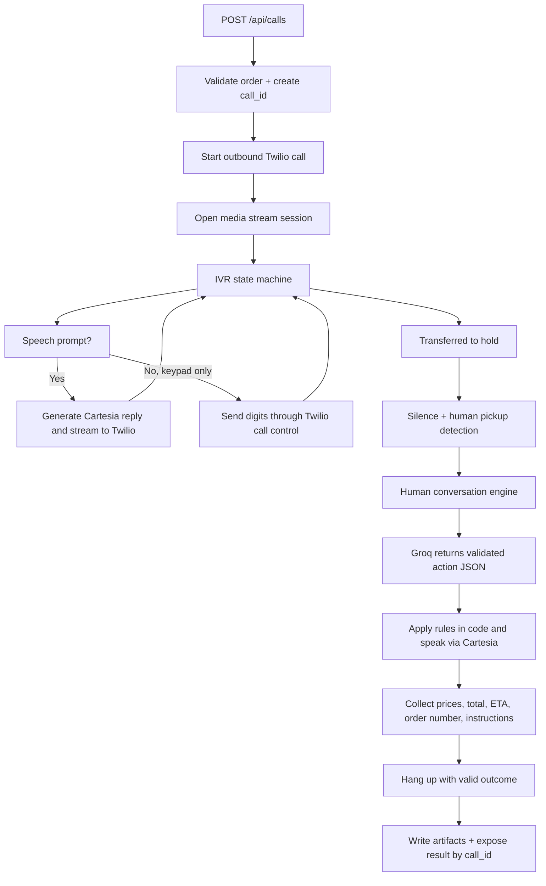

# Voice Agent Plan

## Summary
- Build a Node.js + TypeScript voice agent that uses Twilio for calling, Deepgram for realtime STT, Groq `llama-3.3-70b-versatile` for decision-making, and Cartesia for TTS.
- Optimize milestone one for your own phone roleplay only, not real-store calling.
- Use `Known IVR + clean abstractions`: implement the provided IVR as a deterministic state machine, but keep prompts and transitions configurable for later expansion.
- Keep one active call at a time. Start with a local runtime plus public tunnel. Use a fresh private GitHub repo named `voice-agent-pizza-order` with default branch `main`.
- Resolved missing links: provider choice, runtime stack, hosting mode, repo plan, API shape, concurrency model, planning-doc location, debug-data policy, and milestone target.
- Remaining setup prerequisites: create a Twilio account and number, verify the test phone if on trial, expose a public webhook URL, rotate any real keys written into docs, and create the GitHub repo.

## Easy Breakdown
- The app receives order data.
- It starts an outbound call.
- It gets through the IVR with exact speech or keypad input.
- It stays silent on hold.
- It talks to the human employee naturally, but follows strict ordering, budget, and substitution rules.
- It hangs up with a valid outcome.
- It saves useful artifacts and returns a structured result.

## Key Changes
- Public API:
  - `POST /api/calls` accepts `{ order: OrderRequest, target_number?: string }`.
  - `GET /api/calls/:call_id` returns status, final outcome, and artifact metadata.
  - A CLI helper wraps the HTTP API for local testing with a JSON file.
- Input types:
  - `OrderRequest` matches the task payload exactly.
  - `target_number` is optional and overrides the env default test destination.
  - `CreateCallResponse` returns `{ call_id, status }`.
- Result types:
  - `CallOutcome` is `completed | nothing_available | over_budget | detected_as_bot`.
  - `CallResult` always includes collected data so far, even on failure.
  - `drink` may be `null` with a reason when skipped.
- Runtime architecture:
  - `call-session-manager` owns one live call session keyed by `call_id`.
  - `ivr-state-machine` handles deterministic IVR logic.
  - `conversation-engine` handles the human conversation with Groq, but only through validated JSON actions.
  - `audio-bridge` streams Twilio `mulaw/8000` audio to Deepgram and Cartesia output back to Twilio.
  - `artifact-writer` stores transcripts, events, summaries, and optional audio.
- DTMF strategy:
  - Do not rely on the websocket stream for outbound DTMF.
  - Use Twilio call control for keypad steps.
  - Preferred v1 behavior: when the IVR reaches a keypad-only prompt, issue a Twilio call update that plays the required digits, then resume the media-stream path.
  - Design the session layer to tolerate stream restart or reconnect around those call updates.
- LLM control contract:
  - Groq never directly runs the call.
  - Groq returns validated action JSON such as `say`, `ask_for_exact_price`, `accept_substitution`, `reject_substitution`, `repeat_field`, `confirm_done`, and `hangup_with_outcome`.
  - Business rules stay in code, not only in prompt text.
- Artifact policy:
  - Store useful local artifacts: request payload, event log, transcript log, final result, and redacted summary.
  - Keep raw audio off by default behind an env flag.
  - Keep raw local artifacts private and redact summaries meant for human review.

## Boilerplate To Prepare
- Repo bootstrap:
  - Create a private GitHub repo `voice-agent-pizza-order` on `main`.
  - Add `README`, `.gitignore`, `.env.example`, and startup env validation.
  - Keep planning docs in `planning/`.
- Folder plan:
  - `planning/` for plans, decisions, work notes, and test scripts.
  - `src/` for runtime code.
  - `data/runs/` for local ignored call artifacts.
  - `scripts/` for CLI helpers and test payload runners.
- Core env vars:
  - Twilio account SID, auth token, and phone number.
  - Deepgram API key.
  - Groq API key.
  - Cartesia API key.
  - Default test destination number.
  - Public base URL or websocket URL.
  - `ENABLE_AUDIO_RECORDING=false` by default.
- Initial scaffolding:
  - HTTP server plus websocket server.
  - Twilio outbound-call route and TwiML route.
  - Call session registry.
  - Deepgram streaming client.
  - Groq client with JSON-output validation.
  - Cartesia streaming client set to telephony-compatible output.
  - Structured logging and per-call artifact writer.
- Planning and docs scaffold:
  - `planning/plans/`
  - `planning/decisions/`
  - `planning/worklog/`
  - `planning/test-scripts/`

## Flow

## Test Plan
- Happy path with one topping substitution, side fallback, and drink included.
- IVR prompt handling where the agent must answer with the exact format only.
- IVR retry path when confirmation must restart.
- Hold behavior with silence and delayed human pickup.
- Human pauses while typing; the agent must not interrupt.
- Employee asks for repeats of name, number, or address.
- No-go topping offered and rejected.
- Acceptable substitution offered and accepted.
- Side unavailable, first backup accepted.
- Pizza unavailable, outcome becomes `nothing_available`.
- Pizza and side exceed budget, outcome becomes `over_budget`.
- Drink skipped because it would exceed budget.
- Employee gives a vague price or time; the agent asks for exact values.
- Employee suspects a bot; outcome becomes `detected_as_bot`.
- Twilio stream interruption around the DTMF control path and recovery after reconnect.
- Artifact writing, redaction, and optional audio-recording toggle.

## Assumptions And Defaults
- Milestone one passes when the agent reliably calls your own phone and you can roleplay both IVR and employee.
- Twilio is locked as the provider now. Twilio free trial should be enough for milestone-one testing on your verified phone, but likely not for polished real-store calling.
- The audio path is designed around telephony-native `mulaw/8000` to avoid mandatory transcoding.
- One live call at a time is intentional for v1.
- Local runtime plus tunnel is the first deployment path.
- Planning materials live inside the same repo under `planning/`.
- Raw audio is off by default; transcripts and event logs are always on.
- Secrets must move out of markdown files into env files, and any real exposed keys should be rotated before the repo is used seriously.
- If GitHub ownership is not otherwise specified, create the repo under your personal account.

## Reference Notes
- Twilio media stream audio format and websocket control: [Twilio Media Streams](https://www.twilio.com/docs/voice/media-streams/websocket-messages)
- Twilio outbound calls, `SendDigits`, and live call updates: [Twilio Outbound Calls](https://www.twilio.com/docs/voice/tutorials/how-to-make-outbound-phone-calls), [Twilio Call Resource](https://www.twilio.com/docs/voice/api/call-resource), [Twilio `<Play>`](https://www.twilio.com/docs/voice/twiml/play)
- Deepgram raw `mulaw` support: [Deepgram Encoding](https://developers.deepgram.com/docs/encoding)
- Cartesia telephony-compatible output: [Cartesia TTS Parameters](https://docs.cartesia.ai/build-with-cartesia/capability-guides/choosing-tts-parameters), [Cartesia TTS WebSocket](https://docs.cartesia.ai/api-reference/tts/websocket)
- Groq JSON output pattern for `llama-3.3-70b-versatile`: [Groq Structured Outputs](https://console.groq.com/docs/structured-outputs)
