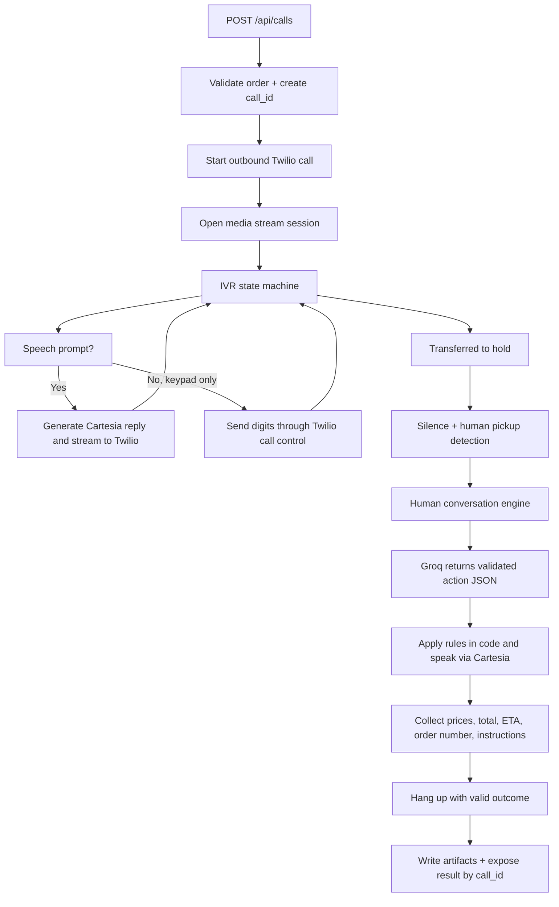

# Voice Agent Plan

## Summary
- Build a Node.js + TypeScript voice agent that uses Twilio for calling, Deepgram for realtime STT, Groq `llama-3.3-70b-versatile` for decision-making, and Cartesia for TTS.
- Optimize milestone one for your own phone roleplay only, not real-store calling.
- Use `Known IVR + clean abstractions`: implement the provided IVR as a deterministic state machine, but keep prompts and transitions configurable for later expansion.
- Keep one active call at a time. Start with a local runtime plus public tunnel. Use a fresh private GitHub repo named `voice-agent-pizza-order` with default branch `main`.
- Resolved high-level links: provider choice, runtime stack, hosting mode, repo plan, API shape, concurrency model, planning-doc location, debug-data policy, and milestone target.
- Remaining lower-level architecture decisions are tracked explicitly below so implementation does not drift on behavior that still needs a call.
- Remaining setup prerequisites: create a Twilio account and number, verify the test phone if on trial, expose a public webhook URL, rotate any real keys written into docs, and create the GitHub repo.
- Extensive logging is a first-class requirement. Every runtime module, provider boundary, and state transition must emit logs that are readable by both a human and another coding agent.

## Easy Breakdown
- The app receives order data.
- It starts an outbound call.
- It gets through the IVR with exact speech or keypad input.
- It stays silent on hold.
- It talks to the human employee naturally, but follows strict ordering, budget, and substitution rules.
- It hangs up with a valid outcome.
- It saves useful artifacts and returns a structured result.

## Key Changes
- Public API:
  - `POST /api/calls` accepts `{ order: OrderRequest, target_number?: string }`.
  - `GET /api/calls/:call_id` returns status, final outcome, and artifact metadata.
  - A CLI helper wraps the HTTP API for local testing with a JSON file.
- Input types:
  - `OrderRequest` matches the task payload exactly.
  - `target_number` is optional and overrides the env default test destination.
  - `CreateCallResponse` returns `{ call_id, status }`.
- Result types:
  - `CallOutcome` is `completed | nothing_available | over_budget | detected_as_bot`.
  - `CallResult` always includes collected data so far, even on failure.
  - `drink` may be `null` with a reason when skipped.
- Runtime architecture:
  - `call-session-manager` owns one live call session keyed by `call_id`.
  - `ivr-state-machine` handles deterministic IVR logic.
  - `conversation-engine` handles the human conversation with Groq, but only through validated JSON actions.
  - `audio-bridge` streams Twilio `mulaw/8000` audio to Deepgram and Cartesia output back to Twilio.
  - `artifact-writer` stores transcripts, events, summaries, and optional audio.
- DTMF strategy:
  - Do not rely on the websocket stream for outbound DTMF.
  - Use Twilio call control for keypad steps.
  - Preferred v1 behavior: when the IVR reaches a keypad-only prompt, issue a Twilio call update that plays the required digits, then resume the media-stream path.
  - Design the session layer to tolerate stream restart or reconnect around those call updates.
- LLM control contract:
  - Groq never directly runs the call.
  - Groq returns validated action JSON such as `say`, `ask_for_exact_price`, `accept_substitution`, `reject_substitution`, `repeat_field`, `confirm_done`, and `hangup_with_outcome`.
  - Business rules stay in code, not only in prompt text.
- Artifact policy:
  - Store useful local artifacts: request payload, event log, transcript log, final result, and redacted summary.
  - Keep raw audio off by default behind an env flag.
  - Keep raw local artifacts private and redact summaries meant for human review.

## Architecture Decisions Still Open
- Session durability and restart behavior:
  - Decide whether live state is strictly in-memory for v1 or whether the runtime should checkpoint enough state to support partial recovery after a process restart.
  - Recommended v1 direction: keep one in-memory owner for the live call, but write append-only events in real time so the full timeline is always recoverable for debugging.
- Turn-taking and interruption policy:
  - Define exact silence thresholds, barge-in handling, and how long the agent waits through employee typing pauses before speaking again.
  - Without this, the conversation engine may sound too eager or too slow even if the core logic is correct.
- Human pickup, voicemail, and hold detection:
  - Decide how the runtime distinguishes hold music, prerecorded messages, voicemail greetings, and an actual human pickup.
  - Also decide whether voicemail is its own terminal outcome or just a failed call variant.
- Twilio control-path behavior around keypad steps:
  - Confirm the single supported strategy for IVR keypad prompts: live call update, `SendDigits`, or TwiML redirect.
  - The current plan favors Twilio call control, but reconnect timing, retry rules, and state ownership around that transition still need to be nailed down.
- Failure taxonomy and retry policy:
  - Define the canonical error classes now: provider timeout, websocket disconnect, malformed LLM action, STT drift, TTS synthesis failure, IVR mismatch, human hangup, and artifact-write failure.
  - For each class, decide whether the session retries, asks for clarification, aborts, or hangs up.
- Outcome model completeness:
  - The current `CallOutcome` enum captures business outcomes, but the architecture still needs a decision on technical terminations such as voicemail, no-answer, provider failure, or IVR exhaustion.
  - Decide whether those become additional outcomes or whether the result contract keeps business outcome separate from a lower-level `terminal_reason`.
- Prompt, model, and ruleset versioning:
  - Every run should record exactly which prompt bundle, model config, and ruleset revision produced the behavior.
  - Without this, debugging regressions after prompt edits will be slower than it should be.
- Latency budget and degraded-mode behavior:
  - Define acceptable end-to-end response latency for the STT -> LLM -> TTS loop and what the agent should do when that budget is missed.
  - This matters because natural phone conversation quality depends as much on timing policy as on correctness.
- Redaction boundary and artifact-sharing policy:
  - Decide which artifacts remain raw and private, which are redacted by default, and which are safe to hand to another agent for diagnosis.
  - This matters because the plan already wants logs and summaries, but it does not yet define the exact privacy boundary for names, phone numbers, and addresses.
- Replay and offline evaluation:
  - Decide whether v1 requires a replay path from saved logs and transcripts alone.
  - Recommended direction: not mandatory for first call success, but mandatory before broad iteration because replay will shorten debugging loops materially.
- Provider abstraction depth:
  - The doc names Twilio, Deepgram, Groq, and Cartesia, but the adapter contract is still underspecified.
  - Decide whether v1 keeps thin provider-specific wrappers or a stricter internal interface so later swaps do not leak vendor details across the codebase.
- Operational guardrails:
  - Decide max call duration, max idle hold duration, max clarification attempts per field, and max repeated IVR failures before forced hangup.
  - These should be explicit constants, not accidental behavior.

## Boilerplate To Prepare
- Repo bootstrap:
  - Create a private GitHub repo `voice-agent-pizza-order` on `main`.
  - Add `README`, `.gitignore`, `.env.example`, and startup env validation.
  - Keep planning docs in `planning/`.
- Folder plan:
  - `planning/` for plans, decisions, work notes, and test scripts.
  - `src/` for runtime code.
  - `data/runs/` for local ignored call artifacts.
  - `scripts/` for CLI helpers and test payload runners.
- Core env vars:
  - Twilio account SID, auth token, and phone number.
  - Deepgram API key.
  - Groq API key.
  - Cartesia API key.
  - Default test destination number.
  - Public base URL or websocket URL.
  - `ENABLE_AUDIO_RECORDING=false` by default.
- Initial scaffolding:
  - HTTP server plus websocket server.
  - Twilio outbound-call route and TwiML route.
  - Call session registry.
  - Logging schema, logger facade, and artifact-writer before provider integrations.
  - Deepgram streaming client.
  - Groq client with JSON-output validation.
  - Cartesia streaming client set to telephony-compatible output.
  - Structured logging and per-call artifact writer wired into every module by default, not added later as cleanup work.
- Planning and docs scaffold:
  - `planning/plans/`
  - `planning/decisions/`
  - `planning/worklog/`
  - `planning/test-scripts/`

## Implementation Plan
- Phase 0: foundation
  - Bootstrap the Node.js + TypeScript app, env validation, folder layout, and call/session identifiers.
  - Logging is part of the foundation, not a later enhancement. No runtime module starts without call-scoped structured logging and artifact output.
- Phase 1: observability first
  - Implement the logger facade, event schema, per-call artifact directory layout, redaction utilities, and a minimal post-call human summary.
  - Success criteria: a new agent or human can inspect one run directory and reconstruct what happened without reading source code first.
- Phase 2: telephony entry and session ownership
  - Add `POST /api/calls`, Twilio outbound call bootstrap, TwiML route, websocket media route, and the call-session manager.
  - Emit logs for request validation, call creation, Twilio request IDs, websocket lifecycle, reconnects, and teardown reasons.
- Phase 3: deterministic IVR navigation
  - Implement the IVR state machine, keypad control path, speech-only prompt handling, retries, and transfer-to-hold transitions.
  - Emit logs for every prompt match, expected response type, actual response sent, retry count, and state transition.
- Phase 4: hold handling and human pickup
  - Implement hold silence behavior, pickup detection, and the transition from deterministic IVR mode into conversation mode.
  - Emit logs for hold start, suspected human speech, false positives, confirmed human pickup, and timeout behavior.
- Phase 5: conversation engine with strict rule enforcement
  - Add Deepgram streaming STT, transcript normalization, Groq action generation, validation of JSON actions, and rule-enforcement code that decides what is actually allowed.
  - Emit logs for transcript segments, confidence, prompt version, action proposals, rule accept/reject decisions, and final spoken output.
- Phase 6: speech output and response timing
  - Add Cartesia synthesis, Twilio audio return path, interruption handling, and the agent speaking policy.
  - Emit logs for TTS request timing, synthesis failures, audio chunk streaming, playback start/stop, and barge-in behavior.
- Phase 7: result assembly, artifacts, and operator workflow
  - Build final result assembly, summaries, redacted views, and any helper scripts needed to inspect a run quickly.
  - Success criteria: the result, timeline, transcript, and key failure points are obvious from artifacts alone.
- Phase 8: replay, regression tests, and iteration loop
  - Add deterministic test fixtures, transcript-based regression checks, and at least a lightweight replay/debug path.
  - Logging remains part of the acceptance criteria: if a bug cannot be explained from logs, observability is still incomplete.

## Flow

## Logging And Observability Plan
- Logging is mandatory for every feature and every code path. Missing logs count as missing functionality, not as optional polish.
- The logs must serve two audiences at once:
  - Humans who need to understand the call flow quickly during live debugging.
  - Coding agents that need machine-readable traces to diagnose failures, reconstruct state transitions, and propose fixes without guesswork.
- Default per-call artifacts:
  - `request.json` for the normalized incoming request and resolved config.
  - `events.jsonl` as the append-only canonical event stream for the full session lifecycle.
  - `transcript.jsonl` for timestamped speaker turns, partial transcripts, finals, confidence, and normalization notes.
  - `actions.jsonl` for LLM action proposals, validation results, rule-engine decisions, and actual emitted speech actions.
  - `summary.md` for a concise human-readable narrative of the call, main timings, warnings, and terminal outcome.
  - `result.json` for the final structured outcome contract.
  - `metrics.json` for per-provider latency, token usage, audio duration, and any cost data the providers expose.
  - Optional `audio/` only when explicitly enabled, never as the default.
- Required fields on every structured event:
  - `timestamp`
  - `call_id`
  - `session_id`
  - `sequence`
  - `component`
  - `event`
  - `level`
  - `direction`
  - `provider`
  - `correlation_id`
  - `latency_ms`
  - `state`
  - `message`
  - `data`
  - `redaction_level`
- Components that must emit logs:
  - API request validation and normalization.
  - Env/config loading.
  - Call-session manager ownership changes.
  - Twilio REST calls, TwiML generation, and webhook handling.
  - Media websocket open, close, heartbeat, reconnect, and backpressure events.
  - IVR state machine prompt detection, retries, and transitions.
  - Outbound keypad/DTMF control path.
  - Hold detector and human-pickup detector.
  - Deepgram streaming connect, partial transcript, final transcript, error, and disconnect events.
  - Transcript normalization and field extraction.
  - Groq request construction, response parsing, JSON validation, and fallback handling.
  - Rule engine decisions, especially every rejected or rewritten LLM action.
  - Cartesia synthesis requests, returned audio chunks, playback lifecycle, and failures.
  - Artifact writer flushes, summary creation, and final result persistence.
  - Terminal outcomes, forced hangups, and uncaught exceptions.
- Minimum logging behavior per component:
  - Log entry, successful exit, state changes, retries, timeouts, validation failures, and every external IO boundary.
  - Log both intent and effect. Example: not just "sent TTS request", but also whether audio started, completed, or failed.
  - Use stable enum-like event names so agents can parse the logs reliably instead of depending on free-form text.
- Human-readable and agent-readable output should both exist:
  - Console logging can be concise and pretty for live use.
  - File artifacts must stay structured and deterministic so Claude or Codex can inspect them directly.
  - `summary.md` should point to suspicious spans and quote the relevant event IDs or sequence numbers.
- Privacy and redaction:
  - Raw local artifacts stay private under `data/runs/<call_id>/`.
  - Redacted summaries should mask or remove secrets and may optionally mask names, phone numbers, and addresses when logs are shared more broadly.
  - Raw audio stays off by default, but transcript and event logs stay on by default.
- Debugging and replay expectations:
  - A human or agent should be able to answer these questions from logs alone:
    - What state was the session in?
    - What did Twilio, Deepgram, Groq, and Cartesia return?
    - Why did the runtime choose the next action?
    - What failed, where, and after which retry count?
  - The log schema should make future replay tooling possible without redesigning the artifacts.
- Default implementation rule:
  - Every new module must define its log events when it is introduced.
  - Every pull request for runtime behavior should be reviewed partly on whether the observability is sufficient for fast diagnosis by a human and by another agent.

## Test Plan
- Happy path with one topping substitution, side fallback, and drink included.
- IVR prompt handling where the agent must answer with the exact format only.
- IVR retry path when confirmation must restart.
- Hold behavior with silence and delayed human pickup.
- Human pauses while typing; the agent must not interrupt.
- Employee asks for repeats of name, number, or address.
- No-go topping offered and rejected.
- Acceptable substitution offered and accepted.
- Side unavailable, first backup accepted.
- Pizza unavailable, outcome becomes `nothing_available`.
- Pizza and side exceed budget, outcome becomes `over_budget`.
- Drink skipped because it would exceed budget.
- Employee gives a vague price or time; the agent asks for exact values.
- Employee suspects a bot; outcome becomes `detected_as_bot`.
- Twilio stream interruption around the DTMF control path and recovery after reconnect.
- Artifact writing, redaction, and optional audio-recording toggle.
- Log completeness check: a fresh human or coding agent can reconstruct the full call timeline, state transitions, provider errors, and final decision path from artifacts alone.
- Log schema check: every major module emits stable event names and includes `call_id`, `component`, `event`, and `sequence`.

## Assumptions And Defaults
- Milestone one passes when the agent reliably calls your own phone and you can roleplay both IVR and employee.
- Twilio is locked as the provider now. Twilio free trial should be enough for milestone-one testing on your verified phone, but likely not for polished real-store calling.
- The audio path is designed around telephony-native `mulaw/8000` to avoid mandatory transcoding.
- One live call at a time is intentional for v1.
- Local runtime plus tunnel is the first deployment path.
- Planning materials live inside the same repo under `planning/`.
- Raw audio is off by default; transcripts and event logs are always on.
- Secrets must move out of markdown files into env files, and any real exposed keys should be rotated before the repo is used seriously.
- If GitHub ownership is not otherwise specified, create the repo under your personal account.

## Reference Notes
- Twilio media stream audio format and websocket control: [Twilio Media Streams](https://www.twilio.com/docs/voice/media-streams/websocket-messages)
- Twilio outbound calls, `SendDigits`, and live call updates: [Twilio Outbound Calls](https://www.twilio.com/docs/voice/tutorials/how-to-make-outbound-phone-calls), [Twilio Call Resource](https://www.twilio.com/docs/voice/api/call-resource), [Twilio `<Play>`](https://www.twilio.com/docs/voice/twiml/play)
- Deepgram raw `mulaw` support: [Deepgram Encoding](https://developers.deepgram.com/docs/encoding)
- Cartesia telephony-compatible output: [Cartesia TTS Parameters](https://docs.cartesia.ai/build-with-cartesia/capability-guides/choosing-tts-parameters), [Cartesia TTS WebSocket](https://docs.cartesia.ai/api-reference/tts/websocket)
- Groq JSON output pattern for `llama-3.3-70b-versatile`: [Groq Structured Outputs](https://console.groq.com/docs/structured-outputs)
